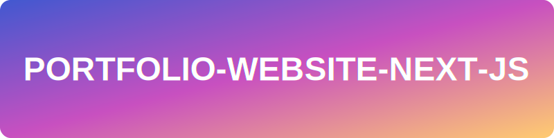

<p align="center">
	
</p>
<p align="center">
	<em><code>❯ Sagar Kundu | Full Stack Developer & Cyber Expert</code></em>
</p>
<p align="center">
	
	
	
	
</p>
<p align="center">Built with the tools and technologies:</p>
<p align="center">
	
	
	
	
	
	
	
	
</p>
<br>

## 🔗 Table of Contents

- [📍 Overview](#-overview)
- [👾 Features](#-features)
- [📁 Project Structure](#-project-structure)
  - [📂 Project Index](#-project-index)
- [🚀 Getting Started](#-getting-started)
  - [☑️ Prerequisites](#-prerequisites)
  - [⚙️ Installation](#-installation)
  - [🤖 Usage](#🤖-usage)
  - [🧪 Testing](#🧪-testing)
- [📌 Project Roadmap](#-project-roadmap)
- [🔰 Contributing](#-contributing)
- [🎗 License](#-license)
- [🙌 Acknowledgments](#-acknowledgments)

---

## 📍 Overview

This portfolio website is built using **Next.js**, a powerful React framework for server-side rendering and static site generation. It leverages **Contentful CMS** as the backend to manage and deliver content seamlessly. The combination of these technologies ensures a fast, scalable, and dynamic user experience, making it an ideal platform to showcase projects, skills, and professional achievements.

---

## 👾 Features

- **Dynamic Blog Section**: A fully dynamic blog section that fetches and displays articles from a CMS, allowing for seamless content updates without redeploying the site.
- **Projects Showcase**: A visually appealing and interactive projects section that highlights your work with detailed descriptions, images, and links to live demos or repositories.
- **Linux-Inspired UI**: A sleek, hacker-style interface inspired by Linux terminal aesthetics, featuring dark mode, terminal-like animations, and a focus on backend development tools.
- **Responsive Design**: Fully responsive layout ensuring a seamless experience across all devices, from desktops to mobile phones.
- **Contentful CMS Integration**: Backend powered by Contentful CMS for easy content management and scalability.
- **Fast and Secure**: Built with Next.js for server-side rendering and optimized performance, ensuring fast load times and enhanced security.
- **Customizable Themes**: Ability to switch between themes, including a hacker-style dark theme and a professional light theme.
- **SEO Optimized**: Fully optimized for search engines to improve visibility and reach.
- **Interactive Animations**: Subtle animations and transitions to enhance user engagement without compromising performance.
- **Developer-Friendly**: Clean, modular codebase with extensive documentation for easy customization and contribution.

---

## 📁 Project Structure

```sh
└── portfolio-website-next-js/
    ├── README.md
    ├── app
    │   ├── about
    │   │   ├── loading.tsx
    │   │   └── page.tsx
    │   ├── blog
    │   │   ├── [slug]
    │   │   ├── loading.tsx
    │   │   └── page.tsx
    │   ├── contact
    │   │   ├── loading.tsx
    │   │   └── page.tsx
    │   ├── experience
    │   │   ├── loading.tsx
    │   │   └── page.tsx
    │   ├── globals.css
    │   ├── layout.tsx
    │   ├── loading.tsx
    │   ├── page.tsx
    │   ├── project
    │   │   ├── [slug]
    │   │   ├── loading.tsx
    │   │   └── page.tsx
    │   ├── robots.ts
    │   └── sitemap.ts
    ├── bun.lock
    ├── components
    │   ├── analytics.tsx
    │   ├── animated-section.tsx
    │   ├── animation-settings-panel.tsx
    │   ├── command-line.tsx
    │   ├── contact-form.tsx
    │   ├── contact-section.tsx
    │   ├── credentials-section.tsx
    │   ├── enhanced-profile.tsx
    │   ├── enhanced-scroll-indicator.tsx
    │   ├── experience-card.tsx
    │   ├── page-loader.tsx
    │   ├── portfolio-header.tsx
    │   ├── project-card.tsx
    │   ├── pwa-install-prompt.tsx
    │   ├── scroll-progress-indicator.tsx
    │   ├── scroll-to-top-button.tsx
    │   ├── scroll-to-top.tsx
    │   ├── search-filter.tsx
    │   ├── service-worker-registration.tsx
    │   ├── sidebar.tsx
    │   ├── skill-tag.tsx
    │   ├── social-links.tsx
    │   ├── terminal-command.tsx
    │   ├── terminal-loader.tsx
    │   ├── terminal-provider.tsx
    │   ├── terminal-text.tsx
    │   ├── terminal-window.tsx
    │   ├── theme-provider.tsx
    │   └── ui
    │       ├── accordion.tsx
    │       ├── alert-dialog.tsx
    │       ├── alert.tsx
    │       ├── aspect-ratio.tsx
    │       ├── avatar.tsx
    │       ├── badge.tsx
    │       ├── breadcrumb.tsx
    │       ├── button.tsx
    │       ├── calendar.tsx
    │       ├── card.tsx
    │       ├── carousel.tsx
    │       ├── chart.tsx
    │       ├── checkbox.tsx
    │       ├── collapsible.tsx
    │       ├── command.tsx
    │       ├── context-menu.tsx
    │       ├── dialog.tsx
    │       ├── drawer.tsx
    │       ├── dropdown-menu.tsx
    │       ├── form.tsx
    │       ├── hover-card.tsx
    │       ├── input-otp.tsx
    │       ├── input.tsx
    │       ├── label.tsx
    │       ├── menubar.tsx
    │       ├── navigation-menu.tsx
    │       ├── pagination.tsx
    │       ├── popover.tsx
    │       ├── progress.tsx
    │       ├── radio-group.tsx
    │       ├── resizable.tsx
    │       ├── scroll-area.tsx
    │       ├── select.tsx
    │       ├── separator.tsx
    │       ├── sheet.tsx
    │       ├── sidebar.tsx
    │       ├── skeleton.tsx
    │       ├── slider.tsx
    │       ├── sonner.tsx
    │       ├── switch.tsx
    │       ├── table.tsx
    │       ├── tabs.tsx
    │       ├── textarea.tsx
    │       ├── toast.tsx
    │       ├── toaster.tsx
    │       ├── toggle-group.tsx
    │       ├── toggle.tsx
    │       ├── tooltip.tsx
    │       ├── use-mobile.tsx
    │       └── use-toast.ts
    ├── components.json
    ├── contexts
    │   └── animation-context.tsx
    ├── data
    │   └── portfolio-data.json
    ├── hooks
    │   ├── use-intersection-observer.ts
    │   ├── use-mobile.tsx
    │   └── use-toast.ts
    ├── lib
    │   ├── data.ts
    │   ├── projects.ts
    │   ├── sitemap-utils.ts
    │   └── utils.ts
    ├── next.config.mjs
    ├── package.json
    ├── pnpm-lock.yaml
    ├── postcss.config.mjs
    ├── public
    │   ├── browserconfig.xml
    │   ├── certs
    │   │   └── ec-council.png
    │   ├── favicon.avif
    │   ├── placeholder-logo.png
    │   ├── placeholder-logo.svg
    │   ├── placeholder-user.jpg
    │   ├── placeholder.jpg
    │   ├── placeholder.svg
    │   ├── projects
    │   │   └── applied-physio
    │   ├── sagarkundu.avif
    │   ├── sagarkundu_square.avif
    │   ├── site.webmanifest
    │   └── sw.js
    ├── styles
    │   └── globals.css
    ├── tailwind.config.js
    └── tsconfig.json
```


### 📂 Project Index
<details open>
	<summary><b><code>PORTFOLIO-WEBSITE-NEXT-JS/</code></b></summary>
	<details> <!-- __root__ Submodule -->
		<summary><b>__root__</b></summary>
		<blockquote>
			<table>
			<tr>
				<td><b><a href='https://github.com/sa001gar/portfolio-website-next-js/blob/master/next.config.mjs'>next.config.mjs</a></b></td>
				<td><code>❯ REPLACE-ME</code></td>
			</tr>
			<tr>
				<td><b><a href='https://github.com/sa001gar/portfolio-website-next-js/blob/master/pnpm-lock.yaml'>pnpm-lock.yaml</a></b></td>
				<td><code>❯ REPLACE-ME</code></td>
			</tr>
			<tr>
				<td><b><a href='https://github.com/sa001gar/portfolio-website-next-js/blob/master/tsconfig.json'>tsconfig.json</a></b></td>
				<td><code>❯ REPLACE-ME</code></td>
			</tr>
			<tr>
				<td><b><a href='https://github.com/sa001gar/portfolio-website-next-js/blob/master/tailwind.config.js'>tailwind.config.js</a></b></td>
				<td><code>❯ REPLACE-ME</code></td>
			</tr>
			<tr>
				<td><b><a href='https://github.com/sa001gar/portfolio-website-next-js/blob/master/postcss.config.mjs'>postcss.config.mjs</a></b></td>
				<td><code>❯ REPLACE-ME</code></td>
			</tr>
			<tr>
				<td><b><a href='https://github.com/sa001gar/portfolio-website-next-js/blob/master/package.json'>package.json</a></b></td>
				<td><code>❯ REPLACE-ME</code></td>
			</tr>
			<tr>
				<td><b><a href='https://github.com/sa001gar/portfolio-website-next-js/blob/master/components.json'>components.json</a></b></td>
				<td><code>❯ REPLACE-ME</code></td>
			</tr>
			</table>
		</blockquote>
	</details>
	<details> <!-- contexts Submodule -->
		<summary><b>contexts</b></summary>
		<blockquote>
			<table>
			<tr>
				<td><b><a href='https://github.com/sa001gar/portfolio-website-next-js/blob/master/contexts/animation-context.tsx'>animation-context.tsx</a></b></td>
				<td><code>❯ REPLACE-ME</code></td>
			</tr>
			</table>
		</blockquote>
	</details>
	<details> <!-- lib Submodule -->
		<summary><b>lib</b></summary>
		<blockquote>
			<table>
			<tr>
				<td><b><a href='https://github.com/sa001gar/portfolio-website-next-js/blob/master/lib/data.ts'>data.ts</a></b></td>
				<td><code>❯ REPLACE-ME</code></td>
			</tr>
			<tr>
				<td><b><a href='https://github.com/sa001gar/portfolio-website-next-js/blob/master/lib/sitemap-utils.ts'>sitemap-utils.ts</a></b></td>
				<td><code>❯ REPLACE-ME</code></td>
			</tr>
			<tr>
				<td><b><a href='https://github.com/sa001gar/portfolio-website-next-js/blob/master/lib/projects.ts'>projects.ts</a></b></td>
				<td><code>❯ REPLACE-ME</code></td>
			</tr>
			<tr>
				<td><b><a href='https://github.com/sa001gar/portfolio-website-next-js/blob/master/lib/utils.ts'>utils.ts</a></b></td>
				<td><code>❯ REPLACE-ME</code></td>
			</tr>
			</table>
		</blockquote>
	</details>
	<details> <!-- styles Submodule -->
		<summary><b>styles</b></summary>
		<blockquote>
			<table>
			<tr>
				<td><b><a href='https://github.com/sa001gar/portfolio-website-next-js/blob/master/styles/globals.css'>globals.css</a></b></td>
				<td><code>❯ REPLACE-ME</code></td>
			</tr>
			</table>
		</blockquote>
	</details>
	<details> <!-- components Submodule -->
		<summary><b>components</b></summary>
		<blockquote>
			<table>
			<tr>
				<td><b><a href='https://github.com/sa001gar/portfolio-website-next-js/blob/master/components/portfolio-header.tsx'>portfolio-header.tsx</a></b></td>
				<td><code>❯ REPLACE-ME</code></td>
			</tr>
			<tr>
				<td><b><a href='https://github.com/sa001gar/portfolio-website-next-js/blob/master/components/pwa-install-prompt.tsx'>pwa-install-prompt.tsx</a></b></td>
				<td><code>❯ REPLACE-ME</code></td>
			</tr>
			<tr>
				<td><b><a href='https://github.com/sa001gar/portfolio-website-next-js/blob/master/components/terminal-loader.tsx'>terminal-loader.tsx</a></b></td>
				<td><code>❯ REPLACE-ME</code></td>
			</tr>
			<tr>
				<td><b><a href='https://github.com/sa001gar/portfolio-website-next-js/blob/master/components/contact-form.tsx'>contact-form.tsx</a></b></td>
				<td><code>❯ REPLACE-ME</code></td>
			</tr>
			<tr>
				<td><b><a href='https://github.com/sa001gar/portfolio-website-next-js/blob/master/components/theme-provider.tsx'>theme-provider.tsx</a></b></td>
				<td><code>❯ REPLACE-ME</code></td>
			</tr>
			<tr>
				<td><b><a href='https://github.com/sa001gar/portfolio-website-next-js/blob/master/components/scroll-to-top.tsx'>scroll-to-top.tsx</a></b></td>
				<td><code>❯ REPLACE-ME</code></td>
			</tr>
			<tr>
				<td><b><a href='https://github.com/sa001gar/portfolio-website-next-js/blob/master/components/credentials-section.tsx'>credentials-section.tsx</a></b></td>
				<td><code>❯ REPLACE-ME</code></td>
			</tr>
			<tr>
				<td><b><a href='https://github.com/sa001gar/portfolio-website-next-js/blob/master/components/skill-tag.tsx'>skill-tag.tsx</a></b></td>
				<td><code>❯ REPLACE-ME</code></td>
			</tr>
			<tr>
				<td><b><a href='https://github.com/sa001gar/portfolio-website-next-js/blob/master/components/search-filter.tsx'>search-filter.tsx</a></b></td>
				<td><code>❯ REPLACE-ME</code></td>
			</tr>
			<tr>
				<td><b><a href='https://github.com/sa001gar/portfolio-website-next-js/blob/master/components/scroll-progress-indicator.tsx'>scroll-progress-indicator.tsx</a></b></td>
				<td><code>❯ REPLACE-ME</code></td>
			</tr>
			<tr>
				<td><b><a href='https://github.com/sa001gar/portfolio-website-next-js/blob/master/components/terminal-window.tsx'>terminal-window.tsx</a></b></td>
				<td><code>❯ REPLACE-ME</code></td>
			</tr>
			<tr>
				<td><b><a href='https://github.com/sa001gar/portfolio-website-next-js/blob/master/components/animation-settings-panel.tsx'>animation-settings-panel.tsx</a></b></td>
				<td><code>❯ REPLACE-ME</code></td>
			</tr>
			<tr>
				<td><b><a href='https://github.com/sa001gar/portfolio-website-next-js/blob/master/components/sidebar.tsx'>sidebar.tsx</a></b></td>
				<td><code>❯ REPLACE-ME</code></td>
			</tr>
			<tr>
				<td><b><a href='https://github.com/sa001gar/portfolio-website-next-js/blob/master/components/contact-section.tsx'>contact-section.tsx</a></b></td>
				<td><code>❯ REPLACE-ME</code></td>
			</tr>
			<tr>
				<td><b><a href='https://github.com/sa001gar/portfolio-website-next-js/blob/master/components/scroll-to-top-button.tsx'>scroll-to-top-button.tsx</a></b></td>
				<td><code>❯ REPLACE-ME</code></td>
			</tr>
			<tr>
				<td><b><a href='https://github.com/sa001gar/portfolio-website-next-js/blob/master/components/analytics.tsx'>analytics.tsx</a></b></td>
				<td><code>❯ REPLACE-ME</code></td>
			</tr>
			<tr>
				<td><b><a href='https://github.com/sa001gar/portfolio-website-next-js/blob/master/components/animated-section.tsx'>animated-section.tsx</a></b></td>
				<td><code>❯ REPLACE-ME</code></td>
			</tr>
			<tr>
				<td><b><a href='https://github.com/sa001gar/portfolio-website-next-js/blob/master/components/social-links.tsx'>social-links.tsx</a></b></td>
				<td><code>❯ REPLACE-ME</code></td>
			</tr>
			<tr>
				<td><b><a href='https://github.com/sa001gar/portfolio-website-next-js/blob/master/components/enhanced-scroll-indicator.tsx'>enhanced-scroll-indicator.tsx</a></b></td>
				<td><code>❯ REPLACE-ME</code></td>
			</tr>
			<tr>
				<td><b><a href='https://github.com/sa001gar/portfolio-website-next-js/blob/master/components/terminal-provider.tsx'>terminal-provider.tsx</a></b></td>
				<td><code>❯ REPLACE-ME</code></td>
			</tr>
			<tr>
				<td><b><a href='https://github.com/sa001gar/portfolio-website-next-js/blob/master/components/page-loader.tsx'>page-loader.tsx</a></b></td>
				<td><code>❯ REPLACE-ME</code></td>
			</tr>
			<tr>
				<td><b><a href='https://github.com/sa001gar/portfolio-website-next-js/blob/master/components/experience-card.tsx'>experience-card.tsx</a></b></td>
				<td><code>❯ REPLACE-ME</code></td>
			</tr>
			<tr>
				<td><b><a href='https://github.com/sa001gar/portfolio-website-next-js/blob/master/components/project-card.tsx'>project-card.tsx</a></b></td>
				<td><code>❯ REPLACE-ME</code></td>
			</tr>
			<tr>
				<td><b><a href='https://github.com/sa001gar/portfolio-website-next-js/blob/master/components/enhanced-profile.tsx'>enhanced-profile.tsx</a></b></td>
				<td><code>❯ REPLACE-ME</code></td>
			</tr>
			<tr>
				<td><b><a href='https://github.com/sa001gar/portfolio-website-next-js/blob/master/components/terminal-command.tsx'>terminal-command.tsx</a></b></td>
				<td><code>❯ REPLACE-ME</code></td>
			</tr>
			<tr>
				<td><b><a href='https://github.com/sa001gar/portfolio-website-next-js/blob/master/components/terminal-text.tsx'>terminal-text.tsx</a></b></td>
				<td><code>❯ REPLACE-ME</code></td>
			</tr>
			<tr>
				<td><b><a href='https://github.com/sa001gar/portfolio-website-next-js/blob/master/components/service-worker-registration.tsx'>service-worker-registration.tsx</a></b></td>
				<td><code>❯ REPLACE-ME</code></td>
			</tr>
			<tr>
				<td><b><a href='https://github.com/sa001gar/portfolio-website-next-js/blob/master/components/command-line.tsx'>command-line.tsx</a></b></td>
				<td><code>❯ REPLACE-ME</code></td>
			</tr>
			</table>
			<details>
				<summary><b>ui</b></summary>
				<blockquote>
					<table>
					<tr>
						<td><b><a href='https://github.com/sa001gar/portfolio-website-next-js/blob/master/components/ui/context-menu.tsx'>context-menu.tsx</a></b></td>
						<td><code>❯ REPLACE-ME</code></td>
					</tr>
					<tr>
						<td><b><a href='https://github.com/sa001gar/portfolio-website-next-js/blob/master/components/ui/toaster.tsx'>toaster.tsx</a></b></td>
						<td><code>❯ REPLACE-ME</code></td>
					</tr>
					<tr>
						<td><b><a href='https://github.com/sa001gar/portfolio-website-next-js/blob/master/components/ui/accordion.tsx'>accordion.tsx</a></b></td>
						<td><code>❯ REPLACE-ME</code></td>
					</tr>
					<tr>
						<td><b><a href='https://github.com/sa001gar/portfolio-website-next-js/blob/master/components/ui/alert-dialog.tsx'>alert-dialog.tsx</a></b></td>
						<td><code>❯ REPLACE-ME</code></td>
					</tr>
					<tr>
						<td><b><a href='https://github.com/sa001gar/portfolio-website-next-js/blob/master/components/ui/radio-group.tsx'>radio-group.tsx</a></b></td>
						<td><code>❯ REPLACE-ME</code></td>
					</tr>
					<tr>
						<td><b><a href='https://github.com/sa001gar/portfolio-website-next-js/blob/master/components/ui/checkbox.tsx'>checkbox.tsx</a></b></td>
						<td><code>❯ REPLACE-ME</code></td>
					</tr>
					<tr>
						<td><b><a href='https://github.com/sa001gar/portfolio-website-next-js/blob/master/components/ui/input-otp.tsx'>input-otp.tsx</a></b></td>
						<td><code>❯ REPLACE-ME</code></td>
					</tr>
					<tr>
						<td><b><a href='https://github.com/sa001gar/portfolio-website-next-js/blob/master/components/ui/sheet.tsx'>sheet.tsx</a></b></td>
						<td><code>❯ REPLACE-ME</code></td>
					</tr>
					<tr>
						<td><b><a href='https://github.com/sa001gar/portfolio-website-next-js/blob/master/components/ui/progress.tsx'>progress.tsx</a></b></td>
						<td><code>❯ REPLACE-ME</code></td>
					</tr>
					<tr>
						<td><b><a href='https://github.com/sa001gar/portfolio-website-next-js/blob/master/components/ui/badge.tsx'>badge.tsx</a></b></td>
						<td><code>❯ REPLACE-ME</code></td>
					</tr>
					<tr>
						<td><b><a href='https://github.com/sa001gar/portfolio-website-next-js/blob/master/components/ui/breadcrumb.tsx'>breadcrumb.tsx</a></b></td>
						<td><code>❯ REPLACE-ME</code></td>
					</tr>
					<tr>
						<td><b><a href='https://github.com/sa001gar/portfolio-website-next-js/blob/master/components/ui/sidebar.tsx'>sidebar.tsx</a></b></td>
						<td><code>❯ REPLACE-ME</code></td>
					</tr>
					<tr>
						<td><b><a href='https://github.com/sa001gar/portfolio-website-next-js/blob/master/components/ui/pagination.tsx'>pagination.tsx</a></b></td>
						<td><code>❯ REPLACE-ME</code></td>
					</tr>
					<tr>
						<td><b><a href='https://github.com/sa001gar/portfolio-website-next-js/blob/master/components/ui/label.tsx'>label.tsx</a></b></td>
						<td><code>❯ REPLACE-ME</code></td>
					</tr>
					<tr>
						<td><b><a href='https://github.com/sa001gar/portfolio-website-next-js/blob/master/components/ui/scroll-area.tsx'>scroll-area.tsx</a></b></td>
						<td><code>❯ REPLACE-ME</code></td>
					</tr>
					<tr>
						<td><b><a href='https://github.com/sa001gar/portfolio-website-next-js/blob/master/components/ui/input.tsx'>input.tsx</a></b></td>
						<td><code>❯ REPLACE-ME</code></td>
					</tr>
					<tr>
						<td><b><a href='https://github.com/sa001gar/portfolio-website-next-js/blob/master/components/ui/textarea.tsx'>textarea.tsx</a></b></td>
						<td><code>❯ REPLACE-ME</code></td>
					</tr>
					<tr>
						<td><b><a href='https://github.com/sa001gar/portfolio-website-next-js/blob/master/components/ui/toast.tsx'>toast.tsx</a></b></td>
						<td><code>❯ REPLACE-ME</code></td>
					</tr>
					<tr>
						<td><b><a href='https://github.com/sa001gar/portfolio-website-next-js/blob/master/components/ui/separator.tsx'>separator.tsx</a></b></td>
						<td><code>❯ REPLACE-ME</code></td>
					</tr>
					<tr>
						<td><b><a href='https://github.com/sa001gar/portfolio-website-next-js/blob/master/components/ui/toggle-group.tsx'>toggle-group.tsx</a></b></td>
						<td><code>❯ REPLACE-ME</code></td>
					</tr>
					<tr>
						<td><b><a href='https://github.com/sa001gar/portfolio-website-next-js/blob/master/components/ui/command.tsx'>command.tsx</a></b></td>
						<td><code>❯ REPLACE-ME</code></td>
					</tr>
					<tr>
						<td><b><a href='https://github.com/sa001gar/portfolio-website-next-js/blob/master/components/ui/popover.tsx'>popover.tsx</a></b></td>
						<td><code>❯ REPLACE-ME</code></td>
					</tr>
					<tr>
						<td><b><a href='https://github.com/sa001gar/portfolio-website-next-js/blob/master/components/ui/slider.tsx'>slider.tsx</a></b></td>
						<td><code>❯ REPLACE-ME</code></td>
					</tr>
					<tr>
						<td><b><a href='https://github.com/sa001gar/portfolio-website-next-js/blob/master/components/ui/form.tsx'>form.tsx</a></b></td>
						<td><code>❯ REPLACE-ME</code></td>
					</tr>
					<tr>
						<td><b><a href='https://github.com/sa001gar/portfolio-website-next-js/blob/master/components/ui/select.tsx'>select.tsx</a></b></td>
						<td><code>❯ REPLACE-ME</code></td>
					</tr>
					<tr>
						<td><b><a href='https://github.com/sa001gar/portfolio-website-next-js/blob/master/components/ui/button.tsx'>button.tsx</a></b></td>
						<td><code>❯ REPLACE-ME</code></td>
					</tr>
					<tr>
						<td><b><a href='https://github.com/sa001gar/portfolio-website-next-js/blob/master/components/ui/drawer.tsx'>drawer.tsx</a></b></td>
						<td><code>❯ REPLACE-ME</code></td>
					</tr>
					<tr>
						<td><b><a href='https://github.com/sa001gar/portfolio-website-next-js/blob/master/components/ui/toggle.tsx'>toggle.tsx</a></b></td>
						<td><code>❯ REPLACE-ME</code></td>
					</tr>
					<tr>
						<td><b><a href='https://github.com/sa001gar/portfolio-website-next-js/blob/master/components/ui/dialog.tsx'>dialog.tsx</a></b></td>
						<td><code>❯ REPLACE-ME</code></td>
					</tr>
					<tr>
						<td><b><a href='https://github.com/sa001gar/portfolio-website-next-js/blob/master/components/ui/alert.tsx'>alert.tsx</a></b></td>
						<td><code>❯ REPLACE-ME</code></td>
					</tr>
					<tr>
						<td><b><a href='https://github.com/sa001gar/portfolio-website-next-js/blob/master/components/ui/carousel.tsx'>carousel.tsx</a></b></td>
						<td><code>❯ REPLACE-ME</code></td>
					</tr>
					<tr>
						<td><b><a href='https://github.com/sa001gar/portfolio-website-next-js/blob/master/components/ui/navigation-menu.tsx'>navigation-menu.tsx</a></b></td>
						<td><code>❯ REPLACE-ME</code></td>
					</tr>
					<tr>
						<td><b><a href='https://github.com/sa001gar/portfolio-website-next-js/blob/master/components/ui/table.tsx'>table.tsx</a></b></td>
						<td><code>❯ REPLACE-ME</code></td>
					</tr>
					<tr>
						<td><b><a href='https://github.com/sa001gar/portfolio-website-next-js/blob/master/components/ui/tabs.tsx'>tabs.tsx</a></b></td>
						<td><code>❯ REPLACE-ME</code></td>
					</tr>
					<tr>
						<td><b><a href='https://github.com/sa001gar/portfolio-website-next-js/blob/master/components/ui/skeleton.tsx'>skeleton.tsx</a></b></td>
						<td><code>❯ REPLACE-ME</code></td>
					</tr>
					<tr>
						<td><b><a href='https://github.com/sa001gar/portfolio-website-next-js/blob/master/components/ui/use-toast.ts'>use-toast.ts</a></b></td>
						<td><code>❯ REPLACE-ME</code></td>
					</tr>
					<tr>
						<td><b><a href='https://github.com/sa001gar/portfolio-website-next-js/blob/master/components/ui/switch.tsx'>switch.tsx</a></b></td>
						<td><code>❯ REPLACE-ME</code></td>
					</tr>
					<tr>
						<td><b><a href='https://github.com/sa001gar/portfolio-website-next-js/blob/master/components/ui/dropdown-menu.tsx'>dropdown-menu.tsx</a></b></td>
						<td><code>❯ REPLACE-ME</code></td>
					</tr>
					<tr>
						<td><b><a href='https://github.com/sa001gar/portfolio-website-next-js/blob/master/components/ui/collapsible.tsx'>collapsible.tsx</a></b></td>
						<td><code>❯ REPLACE-ME</code></td>
					</tr>
					<tr>
						<td><b><a href='https://github.com/sa001gar/portfolio-website-next-js/blob/master/components/ui/menubar.tsx'>menubar.tsx</a></b></td>
						<td><code>❯ REPLACE-ME</code></td>
					</tr>
					<tr>
						<td><b><a href='https://github.com/sa001gar/portfolio-website-next-js/blob/master/components/ui/resizable.tsx'>resizable.tsx</a></b></td>
						<td><code>❯ REPLACE-ME</code></td>
					</tr>
					<tr>
						<td><b><a href='https://github.com/sa001gar/portfolio-website-next-js/blob/master/components/ui/chart.tsx'>chart.tsx</a></b></td>
						<td><code>❯ REPLACE-ME</code></td>
					</tr>
					<tr>
						<td><b><a href='https://github.com/sa001gar/portfolio-website-next-js/blob/master/components/ui/avatar.tsx'>avatar.tsx</a></b></td>
						<td><code>❯ REPLACE-ME</code></td>
					</tr>
					<tr>
						<td><b><a href='https://github.com/sa001gar/portfolio-website-next-js/blob/master/components/ui/hover-card.tsx'>hover-card.tsx</a></b></td>
						<td><code>❯ REPLACE-ME</code></td>
					</tr>
					<tr>
						<td><b><a href='https://github.com/sa001gar/portfolio-website-next-js/blob/master/components/ui/aspect-ratio.tsx'>aspect-ratio.tsx</a></b></td>
						<td><code>❯ REPLACE-ME</code></td>
					</tr>
					<tr>
						<td><b><a href='https://github.com/sa001gar/portfolio-website-next-js/blob/master/components/ui/calendar.tsx'>calendar.tsx</a></b></td>
						<td><code>❯ REPLACE-ME</code></td>
					</tr>
					<tr>
						<td><b><a href='https://github.com/sa001gar/portfolio-website-next-js/blob/master/components/ui/tooltip.tsx'>tooltip.tsx</a></b></td>
						<td><code>❯ REPLACE-ME</code></td>
					</tr>
					<tr>
						<td><b><a href='https://github.com/sa001gar/portfolio-website-next-js/blob/master/components/ui/sonner.tsx'>sonner.tsx</a></b></td>
						<td><code>❯ REPLACE-ME</code></td>
					</tr>
					<tr>
						<td><b><a href='https://github.com/sa001gar/portfolio-website-next-js/blob/master/components/ui/use-mobile.tsx'>use-mobile.tsx</a></b></td>
						<td><code>❯ REPLACE-ME</code></td>
					</tr>
					<tr>
						<td><b><a href='https://github.com/sa001gar/portfolio-website-next-js/blob/master/components/ui/card.tsx'>card.tsx</a></b></td>
						<td><code>❯ REPLACE-ME</code></td>
					</tr>
					</table>
				</blockquote>
			</details>
		</blockquote>
	</details>
	<details> <!-- hooks Submodule -->
		<summary><b>hooks</b></summary>
		<blockquote>
			<table>
			<tr>
				<td><b><a href='https://github.com/sa001gar/portfolio-website-next-js/blob/master/hooks/use-intersection-observer.ts'>use-intersection-observer.ts</a></b></td>
				<td><code>❯ REPLACE-ME</code></td>
			</tr>
			<tr>
				<td><b><a href='https://github.com/sa001gar/portfolio-website-next-js/blob/master/hooks/use-toast.ts'>use-toast.ts</a></b></td>
				<td><code>❯ REPLACE-ME</code></td>
			</tr>
			<tr>
				<td><b><a href='https://github.com/sa001gar/portfolio-website-next-js/blob/master/hooks/use-mobile.tsx'>use-mobile.tsx</a></b></td>
				<td><code>❯ REPLACE-ME</code></td>
			</tr>
			</table>
		</blockquote>
	</details>
	<details> <!-- public Submodule -->
		<summary><b>public</b></summary>
		<blockquote>
			<table>
			<tr>
				<td><b><a href='https://github.com/sa001gar/portfolio-website-next-js/blob/master/public/favicon.avif'>favicon.avif</a></b></td>
				<td><code>❯ REPLACE-ME</code></td>
			</tr>
			<tr>
				<td><b><a href='https://github.com/sa001gar/portfolio-website-next-js/blob/master/public/sagarkundu_square.avif'>sagarkundu_square.avif</a></b></td>
				<td><code>❯ REPLACE-ME</code></td>
			</tr>
			<tr>
				<td><b><a href='https://github.com/sa001gar/portfolio-website-next-js/blob/master/public/sagarkundu.avif'>sagarkundu.avif</a></b></td>
				<td><code>❯ REPLACE-ME</code></td>
			</tr>
			<tr>
				<td><b><a href='https://github.com/sa001gar/portfolio-website-next-js/blob/master/public/site.webmanifest'>site.webmanifest</a></b></td>
				<td><code>❯ REPLACE-ME</code></td>
			</tr>
			<tr>
				<td><b><a href='https://github.com/sa001gar/portfolio-website-next-js/blob/master/public/sw.js'>sw.js</a></b></td>
				<td><code>❯ REPLACE-ME</code></td>
			</tr>
			</table>
			<details>
				<summary><b>projects</b></summary>
				<blockquote>
					<details>
						<summary><b>applied-physio</b></summary>
						<blockquote>
							<table>
							<tr>
								<td><b><a href='https://github.com/sa001gar/portfolio-website-next-js/blob/master/public/projects/applied-physio/main.avif'>main.avif</a></b></td>
								<td><code>❯ REPLACE-ME</code></td>
							</tr>
							<tr>
								<td><b><a href='https://github.com/sa001gar/portfolio-website-next-js/blob/master/public/projects/applied-physio/services.avif'>services.avif</a></b></td>
								<td><code>❯ REPLACE-ME</code></td>
							</tr>
							<tr>
								<td><b><a href='https://github.com/sa001gar/portfolio-website-next-js/blob/master/public/projects/applied-physio/contact.avif'>contact.avif</a></b></td>
								<td><code>❯ REPLACE-ME</code></td>
							</tr>
							</table>
						</blockquote>
					</details>
				</blockquote>
			</details>
		</blockquote>
	</details>
	<details> <!-- app Submodule -->
		<summary><b>app</b></summary>
		<blockquote>
			<table>
			<tr>
				<td><b><a href='https://github.com/sa001gar/portfolio-website-next-js/blob/master/app/layout.tsx'>layout.tsx</a></b></td>
				<td><code>❯ REPLACE-ME</code></td>
			</tr>
			<tr>
				<td><b><a href='https://github.com/sa001gar/portfolio-website-next-js/blob/master/app/sitemap.ts'>sitemap.ts</a></b></td>
				<td><code>❯ REPLACE-ME</code></td>
			</tr>
			<tr>
				<td><b><a href='https://github.com/sa001gar/portfolio-website-next-js/blob/master/app/globals.css'>globals.css</a></b></td>
				<td><code>❯ REPLACE-ME</code></td>
			</tr>
			<tr>
				<td><b><a href='https://github.com/sa001gar/portfolio-website-next-js/blob/master/app/page.tsx'>page.tsx</a></b></td>
				<td><code>❯ REPLACE-ME</code></td>
			</tr>
			<tr>
				<td><b><a href='https://github.com/sa001gar/portfolio-website-next-js/blob/master/app/loading.tsx'>loading.tsx</a></b></td>
				<td><code>❯ REPLACE-ME</code></td>
			</tr>
			<tr>
				<td><b><a href='https://github.com/sa001gar/portfolio-website-next-js/blob/master/app/robots.ts'>robots.ts</a></b></td>
				<td><code>❯ REPLACE-ME</code></td>
			</tr>
			</table>
			<details>
				<summary><b>about</b></summary>
				<blockquote>
					<table>
					<tr>
						<td><b><a href='https://github.com/sa001gar/portfolio-website-next-js/blob/master/app/about/page.tsx'>page.tsx</a></b></td>
						<td><code>❯ REPLACE-ME</code></td>
					</tr>
					<tr>
						<td><b><a href='https://github.com/sa001gar/portfolio-website-next-js/blob/master/app/about/loading.tsx'>loading.tsx</a></b></td>
						<td><code>❯ REPLACE-ME</code></td>
					</tr>
					</table>
				</blockquote>
			</details>
			<details>
				<summary><b>contact</b></summary>
				<blockquote>
					<table>
					<tr>
						<td><b><a href='https://github.com/sa001gar/portfolio-website-next-js/blob/master/app/contact/page.tsx'>page.tsx</a></b></td>
						<td><code>❯ REPLACE-ME</code></td>
					</tr>
					<tr>
						<td><b><a href='https://github.com/sa001gar/portfolio-website-next-js/blob/master/app/contact/loading.tsx'>loading.tsx</a></b></td>
						<td><code>❯ REPLACE-ME</code></td>
					</tr>
					</table>
				</blockquote>
			</details>
			<details>
				<summary><b>experience</b></summary>
				<blockquote>
					<table>
					<tr>
						<td><b><a href='https://github.com/sa001gar/portfolio-website-next-js/blob/master/app/experience/page.tsx'>page.tsx</a></b></td>
						<td><code>❯ REPLACE-ME</code></td>
					</tr>
					<tr>
						<td><b><a href='https://github.com/sa001gar/portfolio-website-next-js/blob/master/app/experience/loading.tsx'>loading.tsx</a></b></td>
						<td><code>❯ REPLACE-ME</code></td>
					</tr>
					</table>
				</blockquote>
			</details>
			<details>
				<summary><b>project</b></summary>
				<blockquote>
					<table>
					<tr>
						<td><b><a href='https://github.com/sa001gar/portfolio-website-next-js/blob/master/app/project/page.tsx'>page.tsx</a></b></td>
						<td><code>❯ REPLACE-ME</code></td>
					</tr>
					<tr>
						<td><b><a href='https://github.com/sa001gar/portfolio-website-next-js/blob/master/app/project/loading.tsx'>loading.tsx</a></b></td>
						<td><code>❯ REPLACE-ME</code></td>
					</tr>
					</table>
					<details>
						<summary><b>[slug]</b></summary>
						<blockquote>
							<table>
							<tr>
								<td><b><a href='https://github.com/sa001gar/portfolio-website-next-js/blob/master/app/project/[slug]/not-found.tsx'>not-found.tsx</a></b></td>
								<td><code>❯ REPLACE-ME</code></td>
							</tr>
							<tr>
								<td><b><a href='https://github.com/sa001gar/portfolio-website-next-js/blob/master/app/project/[slug]/page.tsx'>page.tsx</a></b></td>
								<td><code>❯ REPLACE-ME</code></td>
							</tr>
							<tr>
								<td><b><a href='https://github.com/sa001gar/portfolio-website-next-js/blob/master/app/project/[slug]/loading.tsx'>loading.tsx</a></b></td>
								<td><code>❯ REPLACE-ME</code></td>
							</tr>
							</table>
						</blockquote>
					</details>
				</blockquote>
			</details>
			<details>
				<summary><b>blog</b></summary>
				<blockquote>
					<table>
					<tr>
						<td><b><a href='https://github.com/sa001gar/portfolio-website-next-js/blob/master/app/blog/page.tsx'>page.tsx</a></b></td>
						<td><code>❯ REPLACE-ME</code></td>
					</tr>
					<tr>
						<td><b><a href='https://github.com/sa001gar/portfolio-website-next-js/blob/master/app/blog/loading.tsx'>loading.tsx</a></b></td>
						<td><code>❯ REPLACE-ME</code></td>
					</tr>
					</table>
					<details>
						<summary><b>[slug]</b></summary>
						<blockquote>
							<table>
							<tr>
								<td><b><a href='https://github.com/sa001gar/portfolio-website-next-js/blob/master/app/blog/[slug]/page.tsx'>page.tsx</a></b></td>
								<td><code>❯ REPLACE-ME</code></td>
							</tr>
							<tr>
								<td><b><a href='https://github.com/sa001gar/portfolio-website-next-js/blob/master/app/blog/[slug]/loading.tsx'>loading.tsx</a></b></td>
								<td><code>❯ REPLACE-ME</code></td>
							</tr>
							</table>
						</blockquote>
					</details>
				</blockquote>
			</details>
		</blockquote>
	</details>
</details>

---
## 🚀 Getting Started

### ☑️ Prerequisites

Before getting started with portfolio-website-next-js, ensure your runtime environment meets the following requirements:

- **Programming Language:** TypeScript
- **Package Manager:** Npm


### ⚙️ Installation

Install portfolio-website-next-js using one of the following methods:

**Build from source:**

1. Clone the portfolio-website-next-js repository:
```sh
❯ git clone https://github.com/sa001gar/portfolio-website-next-js
```

2. Navigate to the project directory:
```sh
❯ cd portfolio-website-next-js
```

3. Install the project dependencies:


**Using `npm`** &nbsp; [](https://www.npmjs.com/)

```sh
❯ npm install
```


### 🤖 Usage
Run portfolio-website-next-js using the following command:
**Using `npm`** &nbsp; [](https://www.npmjs.com/)

```sh
❯ npm start
```


### 🧪 Testing
Run the test suite using the following command:
**Using `npm`** &nbsp; [](https://www.npmjs.com/)

```sh
❯ npm test
```


---
## 📌 Project Roadmap

- [X] **`Task 1`**: <strike>Implement feature one.</strike>
- [ ] **`Task 2`**: Implement feature two.
- [ ] **`Task 3`**: Implement feature three.

---

## 🔰 Contributing

- **💬 [Join the Discussions](https://github.com/sa001gar/portfolio-website-next-js/discussions)**: Share your insights, provide feedback, or ask questions.
- **🐛 [Report Issues](https://github.com/sa001gar/portfolio-website-next-js/issues)**: Submit bugs found or log feature requests for the `portfolio-website-next-js` project.
- **💡 [Submit Pull Requests](https://github.com/sa001gar/portfolio-website-next-js/blob/main/CONTRIBUTING.md)**: Review open PRs, and submit your own PRs.

<details closed>
<summary>Contributing Guidelines</summary>

1. **Fork the Repository**: Start by forking the project repository to your github account.
2. **Clone Locally**: Clone the forked repository to your local machine using a git client.
   ```sh
   git clone https://github.com/sa001gar/portfolio-website-next-js
   ```
3. **Create a New Branch**: Always work on a new branch, giving it a descriptive name.
   ```sh
   git checkout -b new-feature-x
   ```
4. **Make Your Changes**: Develop and test your changes locally.
5. **Commit Your Changes**: Commit with a clear message describing your updates.
   ```sh
   git commit -m 'Implemented new feature x.'
   ```
6. **Push to github**: Push the changes to your forked repository.
   ```sh
   git push origin new-feature-x
   ```
7. **Submit a Pull Request**: Create a PR against the original project repository. Clearly describe the changes and their motivations.
8. **Review**: Once your PR is reviewed and approved, it will be merged into the main branch. Congratulations on your contribution!
</details>

<details closed>
<summary>Contributor Graph</summary>
<br>
<p align="left">
   <a href="https://github.com{/sa001gar/portfolio-website-next-js/}graphs/contributors">
      
   </a>
</p>
</details>

---

## 🎗 License

This project is protected under the [SELECT-A-LICENSE](https://choosealicense.com/licenses) License. For more details, refer to the [LICENSE](https://choosealicense.com/licenses/) file.

---

## 🙌 Acknowledgments

- List any resources, contributors, inspiration, etc. here.

---